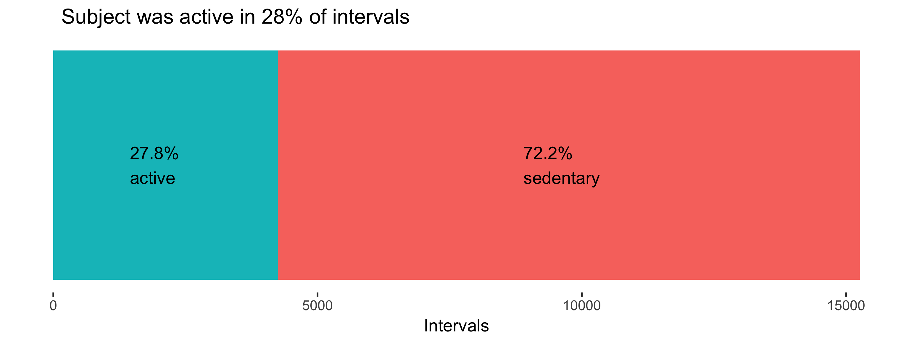
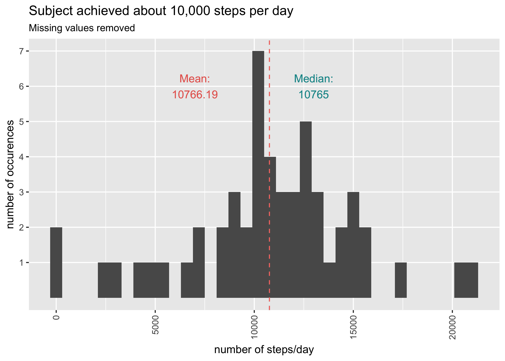
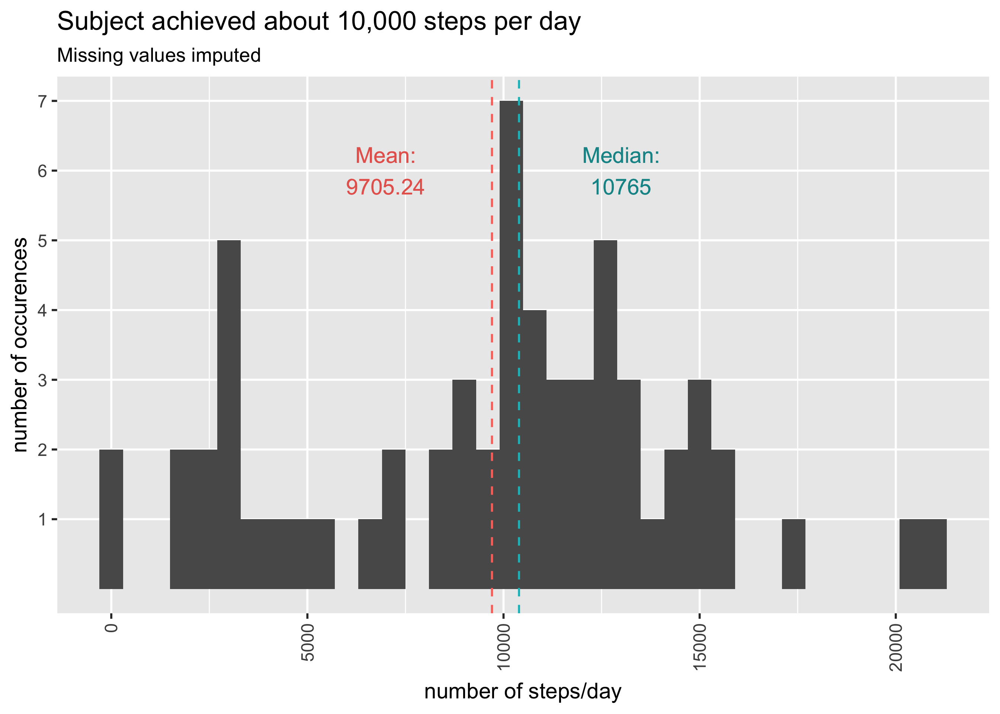
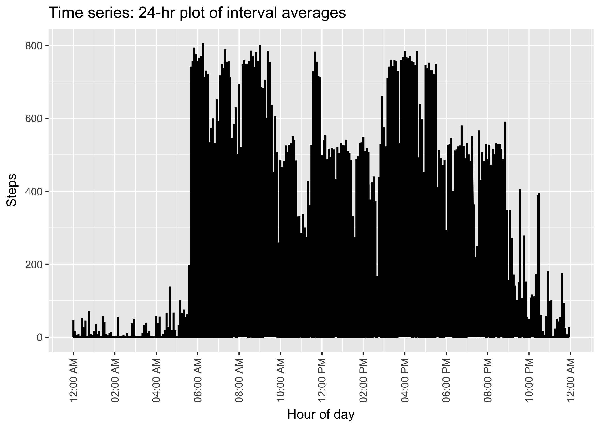
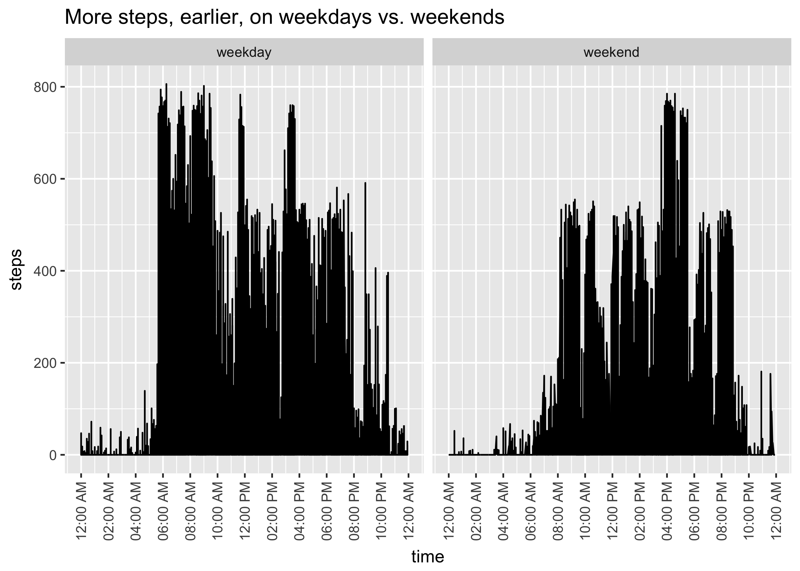

Personal Activity Analysis
================
Chris Sirico
11/27/2017

``` r
knitr::opts_chunk$set(echo=TRUE, fig.retina=4, warning=FALSE, message=FALSE)
activity <- readr::read_csv("activity.csv") # read in data as tibble
```

    ## Parsed with column specification:
    ## cols(
    ##   steps = col_integer(),
    ##   date = col_date(format = ""),
    ##   interval = col_integer()
    ## )

``` r
library(dplyr)
```

    ## Warning: package 'dplyr' was built under R version 3.4.2

    ## 
    ## Attaching package: 'dplyr'

    ## The following objects are masked from 'package:stats':
    ## 
    ##     filter, lag

    ## The following objects are masked from 'package:base':
    ## 
    ##     intersect, setdiff, setequal, union

``` r
library(ggplot2)

# "steps" is number of steps measured in that interval
# "data" is the date in form YYYY-MM-DD
# "interval" has minutes in the rightmost digits and hours in leftmost digits
# let's create a day-of-week, hour and minute column:
activity <- mutate(activity,
              day = weekdays(date),
              hour = interval %/% 100,
              minute = interval %% 100)

# activity$date %>% max() - activity$date %>% min()
#> Time difference of 60 days (length of the study)

# ASSIGNMENT

# - Code for reading in the dataset and/or processing the data
# - Histogram of the total number of steps taken each day
# - Mean and median number of steps taken each day
# - Time series plot of the average number of steps taken
    # continuous, start-to-end
    # by weekday, cumulative
# - The 5-minute interval that, on average, contains the maximum number of steps
    # by weekday
    # by day
# • Code to describe and show a strategy for imputing missing data
    # remove rows w/ missing data for some steps; where is this problematic?
    # take average by weekday and interval of day to impute for others
# • Histogram of the total number of steps taken each day after missing values
# are imputed; kind of already done
# • Panel plot comparing the average number of steps taken per 5-minute interval
# across weekdays and weekends
# - All of the R code needed to reproduce the results (numbers, plots, etc.) in
# the report
```

This is an exploration of pedometer data collected on one subject over a 2-month study.

A preview of the data:

``` r
print(activity)
```

    ## # A tibble: 17,568 x 6
    ##    steps       date interval    day  hour minute
    ##    <int>     <date>    <int>  <chr> <dbl>  <dbl>
    ##  1    NA 2012-10-01        0 Monday     0      0
    ##  2    NA 2012-10-01        5 Monday     0      5
    ##  3    NA 2012-10-01       10 Monday     0     10
    ##  4    NA 2012-10-01       15 Monday     0     15
    ##  5    NA 2012-10-01       20 Monday     0     20
    ##  6    NA 2012-10-01       25 Monday     0     25
    ##  7    NA 2012-10-01       30 Monday     0     30
    ##  8    NA 2012-10-01       35 Monday     0     35
    ##  9    NA 2012-10-01       40 Monday     0     40
    ## 10    NA 2012-10-01       45 Monday     0     45
    ## # ... with 17,558 more rows

The variables are `date`, 5-minute `interval` (as a time of day), and `steps` taken per interval. A day-of-week column has also been added (`day`), and interval has been separated into additional `hour` and `minute` columns.

As can be observed above, some `step` data is missing. 2304 `steps` values (13.1% of data) are missing. A look at the dataset reveals 8 dates for which data are completely missing, but there are no missing values outside those dates.

Those dates can simply be removed from the dataset for most of this exploration. This will still render accurate means, medians, and average `step` counts per day.

Any analysis that involves a count and a day of week (e.g. number of steps taken on Tuesdays), however, would require imputation. A possible option for imputation in such case would be the median `step` value taken by the corresponding `interval` (time of day) and day of week. See the `impute` chunk below for code example.

``` r
# find days with missing data
no_step <- activity %>%
  group_by(date, day) %>%
  summarise(steps = sum(steps, na.rm = FALSE)) %>%
  filter(is.na(steps)) %>%
  arrange(date)

# remove dates with missing values from dataset
activity_na_rm <- activity %>%
  filter(!(date %in% no_step$date))

# plot missing days
activity %>%
  group_by(date) %>%
  summarize(nas = sum(is.na(steps))) %>%
ggplot(aes(date, nas))+
  geom_col() +
  scale_x_date(date_breaks = "1 day") +
  theme(axis.text.x = element_text(angle = 90, hjust = 1, vjust = .5)) +
  labs(title = "Missing values by day",
       subtitle="8 days completely missing; no partially missing days.",
       y = "Number of 5-minute intervals missing")
```


``` r
# IMPUTE
# impute median values for missing days

# puts missing values at bottom of dataframe, in date order
imputed <- activity %>%
  arrange(steps)

# summarize by median
activity_medians <- activity_na_rm %>%
  group_by(day, interval) %>%
  summarize(steps = median(steps)) %>%
  tidyr::spread(day, steps)

# number of missing values
missing_total <- sum(is.na(activity$steps))

# find first missing value
na_start<-(nrow(imputed)-missing_total+1)

# start with first missing value (row 15265)
# get day of week
# find day in activity_medians
# replace steps with median_steps day column for 1 day's rows (288)
# go to next row and get day
# iterate to end of dataframe
for (i in seq(na_start, nrow(imputed), by = 288)){
  for (j in seq(0, 287)){
    imputed$steps[i+j] <- activity_medians[[(j+1),(imputed$day[(i+j)])]]
  }
}
```

It is also worth noting that the dates October 2 and November 15 have miniscule `steps` totals relative to the next lowest days. Both dates follow dates with missing values, and both have their total steps occurring within ten-minute windows. This exploration will treat these dates as valid data; however, follow-up would be warranted to see if the subject failed to wear the tracking device. Then the dates could be discarded or the missing intervals imputed.

Total steps per day, sorted ascending to contrast these and other dates:

``` r
activity_na_rm %>%
  group_by(date) %>%
  summarise(steps = sum(steps)) %>%
  arrange(steps)
```

    ## # A tibble: 53 x 2
    ##          date steps
    ##        <date> <int>
    ##  1 2012-11-15    41
    ##  2 2012-10-02   126
    ##  3 2012-10-25  2492
    ##  4 2012-11-08  3219
    ##  5 2012-11-20  4472
    ##  6 2012-10-29  5018
    ##  7 2012-11-16  5441
    ##  8 2012-10-26  6778
    ##  9 2012-11-29  7047
    ## 10 2012-11-13  7336
    ## # ... with 43 more rows

Below we see summary statistics for our data, without and with zero values removed. These show the trend across all intervals as well as the trend in active intervals.

``` r
activity_na_rm$steps %>% summary()
```

    ##    Min. 1st Qu.  Median    Mean 3rd Qu.    Max. 
    ##    0.00    0.00    0.00   37.38   12.00  806.00

``` r
# removing 0 step rows
zeroless <- activity_na_rm %>% 
  filter(steps != 0) %>%
  select(steps)
summary(zeroless$steps)
```

    ##    Min. 1st Qu.  Median    Mean 3rd Qu.    Max. 
    ##     1.0    25.0    56.0   134.3   146.8   806.0

The maximum steps recorded in a 5-minute interval is 806. That's 2.68 steps per second, on par with a tempo of [161 beats per minute](https://www.youtube.com/watch?v=E2X4Fv4FjE4). That would seem to be faster than a steady jog and perhaps just short of a sprint--quite high-intensity exercise if triggered by the subject's movement. While entirely plausible, it is also possible these high values were caused by the motion of a bumpy vehicle or other outside source.

``` r
arrange(activity, desc(steps))
```

    ## # A tibble: 17,568 x 6
    ##    steps       date interval      day  hour minute
    ##    <int>     <date>    <int>    <chr> <dbl>  <dbl>
    ##  1   806 2012-11-27      615  Tuesday     6     15
    ##  2   802 2012-10-12      900   Friday     9      0
    ##  3   794 2012-11-27      550  Tuesday     5     50
    ##  4   789 2012-11-19      720   Monday     7     20
    ##  5   786 2012-10-15      835   Monday     8     35
    ##  6   785 2012-11-05      925   Monday     9     25
    ##  7   785 2012-11-18     1635   Sunday    16     35
    ##  8   785 2012-11-24     1600 Saturday    16      0
    ##  9   783 2012-10-22     1140   Monday    11     40
    ## 10   781 2012-10-15      850   Monday     8     50
    ## # ... with 17,558 more rows

Looking at the highest number of steps per interval, it also appears the subject exercises in the mornings.

About a quarter of intervals recorded were active:

``` r
# show proportion of movement to sedentary intervals
# Stacked barplot -- pretty hacky way of getting there

total <- nrow(activity_na_rm)

prop <- activity_na_rm %>%
  mutate(
    movement = steps > 0,
    movement2 = "active"
            ) %>%
  group_by(movement, movement2) %>%
  summarize(active = n(),
            prop = active / total
            )

# Calculate the cumulative sum of steps
prop <- plyr::ddply(prop, "movement2",
                   transform, label_pos=cumsum(active))

# Set label locations
prop$label_pos[1] <- 8900
prop$label_pos[2] <- 1450

# Plot proportions
ggplot(prop, aes(x=movement2, y=active, fill=movement)) +
  geom_bar(stat = "identity") +
  coord_flip() +
  labs(title = "Subject was active in 28% of intervals",
    x = NULL,
    y = "Intervals"
  ) +
# active label
  geom_text(data = tibble::as.tibble(split(prop, prop$movement)[[1]]), # use only one row of data
          aes(y=label_pos[1],
              x=movement2[1],
              label=stringr::str_c(as.character(scales::percent(prop[1])), "\nsedentary")
          ),
          hjust = 0) +
  # sedentary label
  geom_text(data = tibble::as.tibble(split(prop, prop$movement)[[2]]), # use only one row of data
            aes(y=label_pos[1],
                x=movement2[1],
                label=stringr::str_c(as.character(scales::percent(prop[1])), "\nactive")
            ),
            hjust = 0) +
  # nix ticks & hide legend
  theme(axis.text.y = element_blank(),
  axis.ticks.y = element_blank(),
  panel.grid.major = element_blank(),
  panel.grid.minor = element_blank(),
  panel.background = element_blank(),
  plot.title = element_text(hjust = .09)) +
  theme(legend.position="none")
```



Here's a look at steps per day with missing values removed versus imputed.

``` r
byday <- activity_na_rm %>%
  group_by(date) %>%
  summarise(steps = sum(steps)) 

ggplot(byday) +
geom_histogram(aes(steps), binwidth = 600) +
#  vertical x labels
theme(axis.text.x = element_text(angle = 90, hjust = 1, vjust = .5)) +
labs(title = "Subject achieved about 10,000 steps per day",
     subtitle = "Missing values removed",
  x = "number of steps/day",
  y = "number of occurences"
) +  # dashed median and mean lines
geom_vline(aes(
  xintercept = median(byday$steps, na.rm = T),
  color = "Median"),
    linetype = "dashed"
) +
geom_vline(aes(
  xintercept = mean(byday$steps, na.rm = T),
  color = "Mean"),
    linetype = "dashed"
) +
scale_y_continuous(breaks = c(1:10),
                   minor_breaks = NULL) +
 geom_text(data = tibble::tibble(steps = c(0, max(byday$steps)),
                date = c(1,2)),
             aes(y=6,
               x=13000,
               label=stringr::str_c("Median:\n", as.character(median(byday$steps, na.rm = T)))
            ),
           color = "#129496"
           ) +
geom_text(data = tibble::tibble(steps = c(0, max(byday$steps)),
                date = c(1,2)),
             aes(y=6,
               x=7000,
               label=stringr::str_c("Mean:\n", as.character(round(mean(byday$steps, na.rm = T), 2)))
            ),
           color = "#E7655C"
           ) +
  theme(legend.position="none")
```



``` r
byday2 <- imputed %>%
  group_by(date) %>%
  summarise(steps = sum(steps)) 

ggplot(byday2) +
geom_histogram(aes(steps), binwidth = 600) +
#  vertical x labels
theme(axis.text.x = element_text(angle = 90, hjust = 1, vjust = .5)) +
labs(title = "Subject achieved about 10,000 steps per day",
     subtitle = "Missing values imputed",
  x = "number of steps/day",
  y = "number of occurences"
) +  # dashed median and mean lines
geom_vline(aes(
  xintercept = median(byday2$steps, na.rm = T),
  color = "Median"),
    linetype = "dashed"
) +
geom_vline(aes(
  xintercept = mean(byday2$steps, na.rm = T),
  color = "Mean"),
    linetype = "dashed"
) +
scale_y_continuous(breaks = c(1:10),
                   minor_breaks = NULL) +
 geom_text(data = tibble::tibble(steps = c(0, max(byday$steps)),
                date = c(1,2)),
             aes(y=6,
               x=13000,
               label=stringr::str_c("Median:\n", as.character(median(byday$steps, na.rm = T)))
            ),
           color = "#129496"
           ) +
geom_text(data = tibble::tibble(steps = c(0, max(byday2$steps)),
                date = c(1,2)),
             aes(y=6,
               x=7000,
               label=stringr::str_c("Mean:\n", as.character(round(mean(byday2$steps, na.rm = T), 2)))
            ),
           color = "#E7655C"
           ) +
  theme(legend.position="none")
```

 The results are similar. Note that the study's subject achieves the expert-recommended [10,000 steps per day](https://www.ncbi.nlm.nih.gov/pubmed/11131268) on most days.

Here is step activity plotted chronologically along duration of study:

``` r
# TIME SERIES PLOT

steps_seq <- activity_na_rm
steps_seq <- tibble::rowid_to_column(steps_seq, "ID")
steps_seq <- steps_seq %>%
  mutate(is.weekend = ifelse(day =="Saturday" | day =="Sunday","weekend","weekday"),
    time = lubridate::ymd_hm(paste0("2012-1-1",
                                    '"',
                                    as.character(hour),
                                    ":",
                                    as.character(minute),
                                    '"')
                             )
    )

ggplot(data = steps_seq, aes(time, steps)) + 
  geom_line(linejoin="mitre", size=.8) +
  labs(title = "Time series: 24-hr plot of interval averages",
  x = "Hour of day",
  y = "Steps"
) +
  scale_x_datetime(date_breaks = "2 hours", date_labels = "%I:%M %p") +
  theme(axis.text.x = element_text(angle = 90, hjust = 1, vjust = .5))
```



And here is a comparison of weekday versus weekend `steps` behavior:

``` r
activity_na_rm %>%
mutate(is.weekend = ifelse(day =="Saturday" | day =="Sunday","weekend","weekday"),
    time = lubridate::ymd_hm(paste0("2012-1-1",
                                    '"',
                                    as.character(hour),
                                    ":",
                                    as.character(minute),
                                    '"')
                             )
  ) %>%

ggplot(aes(time,steps)) +
  geom_line() +
  facet_wrap(~is.weekend) +
  scale_x_datetime(date_breaks = "2 hours", date_labels = "%I:%M %p") +
  #  vertical x labels
  theme(axis.text.x = element_text(angle = 90, hjust = 1, vjust = .5)) +
  labs(title="More steps, earlier, on weekdays vs. weekends")
```


