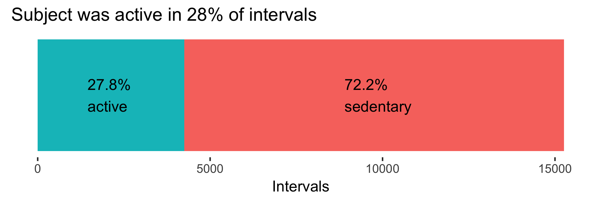
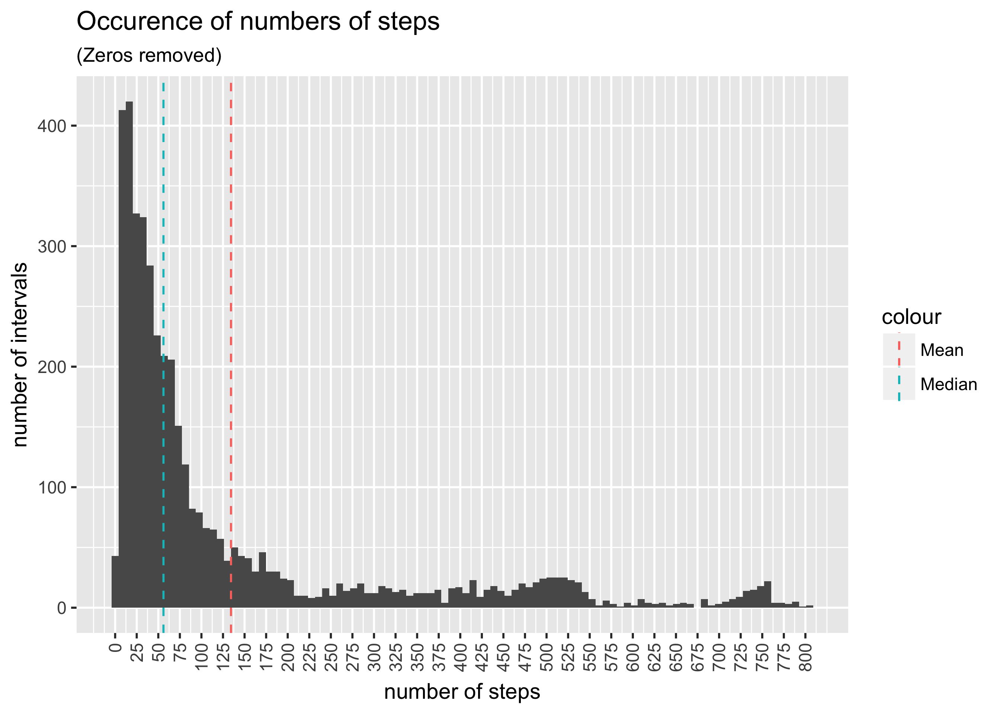
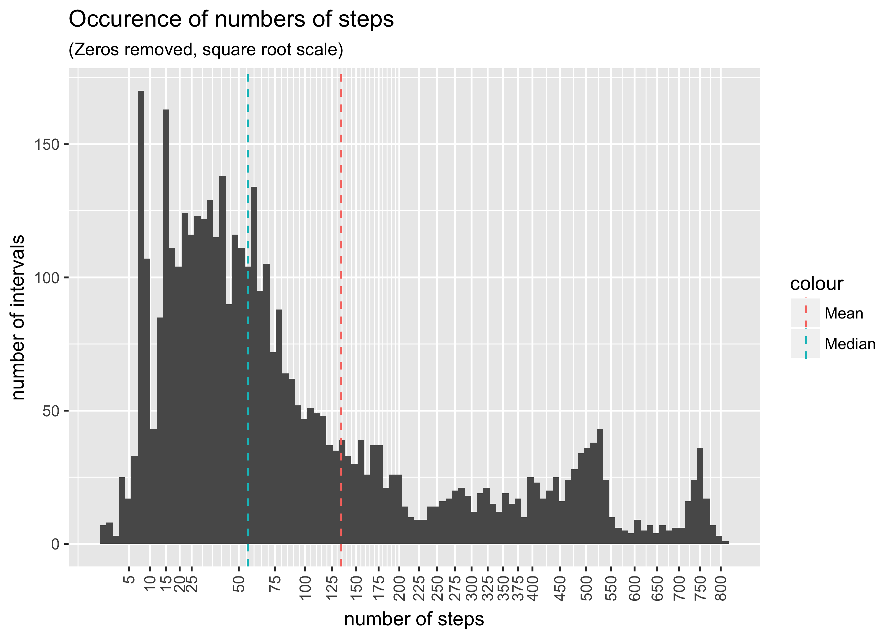

Personal Activity Analysis
================
Chris Sirico
11/27/2017

<!-- ☝️Trying above YAML for updated github-friendly knitr output; code_folding
might not work; might have to use:
    smart: false
    if pandoc causes problems -->
13.1% of steps data is missing. We may have to impute those data or discard them.

``` r
activity$steps %>% summary()
```

    ##    Min. 1st Qu.  Median    Mean 3rd Qu.    Max.    NA's 
    ##    0.00    0.00    0.00   37.38   12.00  806.00    2304

``` r
# removing 0 step rows
activity %>% 
  filter(steps != 0) %>%
  select(steps) %>%
  summary()
```

    ##      steps      
    ##  Min.   :  1.0  
    ##  1st Qu.: 25.0  
    ##  Median : 56.0  
    ##  Mean   :134.3  
    ##  3rd Qu.:146.8  
    ##  Max.   :806.0

It's interesting to note that the maximum number of steps in a 5-minute interval is 806. That's 2.68 steps per second, on par with a tempo of [161 beats per minute](https://www.youtube.com/watch?v=E2X4Fv4FjE4). That would seem to be faster than a steady jog, perhaps just short of a sprint—high-intensity exercise, regardless of the activity.

``` r
arrange(activity, desc(steps))
```

    ## # A tibble: 17,568 x 4
    ##    steps       date interval      day
    ##    <int>     <date>    <int>    <chr>
    ##  1   806 2012-11-27      615  Tuesday
    ##  2   802 2012-10-12      900   Friday
    ##  3   794 2012-11-27      550  Tuesday
    ##  4   789 2012-11-19      720   Monday
    ##  5   786 2012-10-15      835   Monday
    ##  6   785 2012-11-05      925   Monday
    ##  7   785 2012-11-18     1635   Sunday
    ##  8   785 2012-11-24     1600 Saturday
    ##  9   783 2012-10-22     1140   Monday
    ## 10   781 2012-10-15      850   Monday
    ## # ... with 17,558 more rows

Looking at the highest number of steps per interval, it seems like our subject works out early in the morning.

``` r
# show proportion of movement to sedentary intervals
# Stacked barplot with multiple groups

prop <- activity %>%
  filter(!is.na(steps))  # filter out missing values

total <- nrow(prop)

prop <- prop %>%
  mutate(
    movement = steps > 0,
    movement2 = "active"
            ) %>%
  group_by(movement, movement2) %>%
  summarize(active = n(),
            prop = active / total
            )

# Calculate the cumulative sum of steps
prop <- plyr::ddply(prop, "movement2",
                   transform, label_pos=cumsum(active))

#set label locations
prop$label_pos[1] <- 8900
prop$label_pos[2] <- 1450

ggplot(prop, aes(x=movement2, y=active, fill=movement)) +
  geom_bar(stat = "identity") +
  #           color="white", size=3.5)+
  # scale_fill_brewer(palette="Paired")+
  coord_flip() +
  labs(title = "Subject was active in 28% of intervals",
    x = NULL,
    y = "Intervals"
  ) +
# active label
  geom_text(data = tibble::as.tibble(split(prop, prop$movement)[[1]]), # use only one row of data
          aes(y=label_pos[1],
              x=movement2[1],
              label=stringr::str_c(as.character(scales::percent(prop[1])), "\nsedentary")
          ),
          hjust = 0) +
  # sedentary label
  geom_text(data = tibble::as.tibble(split(prop, prop$movement)[[2]]), # use only one row of data
            aes(y=label_pos[1],
                x=movement2[1],
                label=stringr::str_c(as.character(scales::percent(prop[1])), "\nactive")
            ),
            hjust = 0) +
  # theme_classic() +
  # nix ticks & hide legend
  theme(axis.text.y = element_blank(),
  axis.ticks.y = element_blank(),
  panel.grid.major = element_blank(),
  panel.grid.minor = element_blank(),
  panel.background = element_blank()) +
  # clean theme
  theme(legend.position="none")
```



``` r
# zero-less
zeroless <- activity %>% 
filter(steps != 0)
  
ggplot(zeroless) +
geom_histogram(aes(steps),
               bins = 100) +
scale_x_continuous(breaks = seq(0, max(activity$steps, na.rm = T), by = 25)) +
theme(axis.text.x = element_text(angle = 90, hjust = 1, vjust = .5)) +
labs(title = "Occurence of numbers of steps",
  subtitle = "(Zeros removed)",
  x = "number of steps",
  y = "number of intervals"
) +
geom_vline(aes(
  xintercept = median(zeroless$steps, na.rm = T),
  color = "Median"),
    linetype = "dashed"
) +
geom_vline(aes(
  xintercept = mean(zeroless$steps, na.rm = T),
  color = "Mean"),
    linetype = "dashed"
)
```



``` r
# zero-less square root scale
ggplot(zeroless) +
geom_histogram(aes(steps),
               bins = 100) +
scale_x_sqrt(
  breaks = c(
  seq(0, 25, by = 5),
  seq(50, 400, by = 25),
  seq(450, max(activity$steps, na.rm = T), by = 50)
  ),
  minor_breaks = c(
  seq(0, 45, by = 5),
  seq(50, 195, by = 5),
  seq(200, 480, by = 25),
  seq(450, max(activity$steps, na.rm = T), by = 25)
  )
) +
theme(axis.text.x = element_text(angle = 90, hjust = 1, vjust = .5)) +
labs(title = "Occurence of numbers of steps",
  subtitle = "(Zeros removed, square root scale)",
  x = "number of steps",
  y = "number of intervals"
) +
geom_vline(aes(
  xintercept = median(zeroless$steps, na.rm = T),
  color = "Median"),
    linetype = "dashed"
) +
geom_vline(aes(
  xintercept = mean(zeroless$steps, na.rm = T),
  color = "Mean"),
    linetype = "dashed"
)
```


