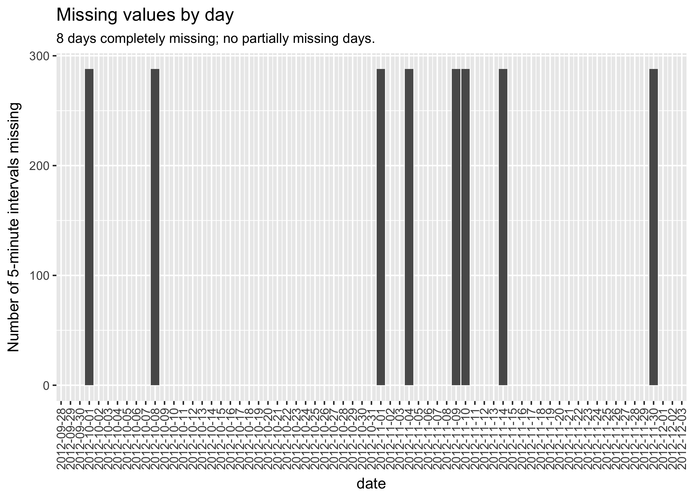
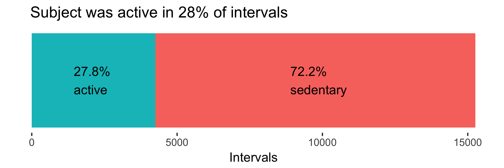
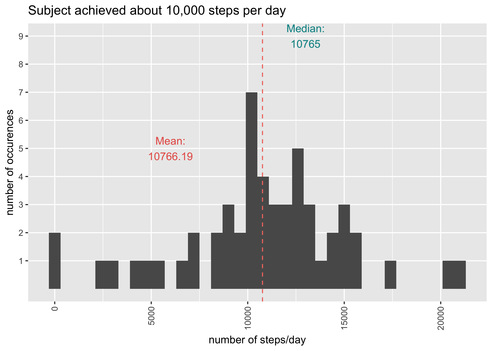
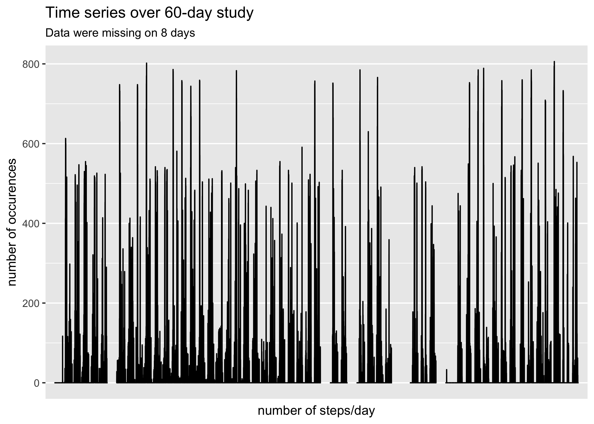

Personal Activity Analysis
================
Chris Sirico
11/27/2017

This is an exploration of pedometer data collected on one subject over a 2-month study.

Let's preview our data.

``` r
print(activity)
```

    ## # A tibble: 17,568 x 6
    ##    steps       date interval    day  hour minute
    ##    <int>     <date>    <int>  <chr> <dbl>  <dbl>
    ##  1    NA 2012-10-01        0 Monday     0      0
    ##  2    NA 2012-10-01        5 Monday     0      5
    ##  3    NA 2012-10-01       10 Monday     0     10
    ##  4    NA 2012-10-01       15 Monday     0     15
    ##  5    NA 2012-10-01       20 Monday     0     20
    ##  6    NA 2012-10-01       25 Monday     0     25
    ##  7    NA 2012-10-01       30 Monday     0     30
    ##  8    NA 2012-10-01       35 Monday     0     35
    ##  9    NA 2012-10-01       40 Monday     0     40
    ## 10    NA 2012-10-01       45 Monday     0     45
    ## # ... with 17,558 more rows

The variables are `date`, 5-minute `interval` (as a time of day), and `steps` taken per interval. A day-of-week column has also been added (`day`), and interval has been separated into additional `hour` and `minute` columns.

13.1% of `steps` data are missing, or 2304 values. A look at the data reveals 8 dates for which those data are completely missing, and there are no missing values outsitde those dates.

We can simply remove those dates from the dataset rather than impute values. This will still render accurate means.

Any analysis that involves a count and day-of-week (e.g. number of steps taken on Tuesdays), however, would require imputation. A possible option for imputation in such case would be the median `step` value taken by the corresponding interval (time of day) and day-of-week.

``` r
# find days with missing data
no_step <- activity %>%
  group_by(date, day) %>%
  summarise(steps = sum(steps, na.rm = FALSE)) %>%
  filter(is.na(steps)) %>%
  arrange(date)

# remove dates with missing values from dataset
# this doesn't work
activity_na_rm <- activity %>%
  filter(!(date %in% no_step$date))

# plot missing days
activity %>%
  group_by(date) %>%
  summarize(nas = sum(is.na(steps))) %>%
ggplot(aes(date, nas))+
  geom_col() +
  scale_x_date(date_breaks = "1 day") +
  theme(axis.text.x = element_text(angle = 90, hjust = 1, vjust = .5)) +
  labs(title = "Missing values by day",
       subtitle="8 days completely missing; no partially missing days.",
       y = "Number of 5-minute intervals missing")
```



``` r
# impute median values for missing days
activity_medians <- activity_na_rm %>%
  group_by(day, interval) %>%
  summarize(steps = median(steps)) %>%
  tidyr::spread(day, steps)

# number of missing values
missing_total <- sum(is.na(activity$steps))

# puts missing values at bottom of dataframe, in date order
imputed <- activity %>%
  arrange(steps)

# getting an error when I subset:
#> 1: Unknown or uninitialised column: 'steps'.
# trying this to fix that
col_names <- names(imputed)
names(imputed) <- col_names

# find first missing value
na_start<-(nrow(imputed)-missing_total+1)

# start with first missing value
# replace 1 day's steps values with medians by day of week & interval
# iterate to end of dataframe
# go to beginning of NAs (row 15265)
# get day
# find day in activity_medians
#replace steps with median_steps$day[match] from starting row number - 288 rows
# go to next row and get day
# rinse and repeat through end of dataframe

for (i in seq(na_start, nrow(imputed), by = 288)){
  for (j in seq(0, 287)){
    imputed$steps[i+j] <- activity_medians[[(j+1),(imputed$day[(i+j)])]]
    
  }
}
```

``` r
activity$steps %>% summary()
```

    ##    Min. 1st Qu.  Median    Mean 3rd Qu.    Max.    NA's 
    ##    0.00    0.00    0.00   37.38   12.00  806.00    2304

``` r
# removing 0 step rows
activity %>% 
  filter(steps != 0) %>%
  select(steps) %>%
  summary()
```

    ##      steps      
    ##  Min.   :  1.0  
    ##  1st Qu.: 25.0  
    ##  Median : 56.0  
    ##  Mean   :134.3  
    ##  3rd Qu.:146.8  
    ##  Max.   :806.0

It's interesting to note that the maximum number of steps in a 5-minute interval is 806. That's 2.68 steps per second, on par with a tempo of [161 beats per minute](https://www.youtube.com/watch?v=E2X4Fv4FjE4). That would seem to be faster than a steady jog and perhaps just short of a sprint. High-intensity exercise, regardless of the activity.

``` r
arrange(activity, desc(steps))
```

    ## # A tibble: 17,568 x 6
    ##    steps       date interval      day  hour minute
    ##    <int>     <date>    <int>    <chr> <dbl>  <dbl>
    ##  1   806 2012-11-27      615  Tuesday     6     15
    ##  2   802 2012-10-12      900   Friday     9      0
    ##  3   794 2012-11-27      550  Tuesday     5     50
    ##  4   789 2012-11-19      720   Monday     7     20
    ##  5   786 2012-10-15      835   Monday     8     35
    ##  6   785 2012-11-05      925   Monday     9     25
    ##  7   785 2012-11-18     1635   Sunday    16     35
    ##  8   785 2012-11-24     1600 Saturday    16      0
    ##  9   783 2012-10-22     1140   Monday    11     40
    ## 10   781 2012-10-15      850   Monday     8     50
    ## # ... with 17,558 more rows

Looking at the highest number of steps per interval, it seems like our subject works out early in the morning.

``` r
# show proportion of movement to sedentary intervals
# Stacked barplot -- pretty hacky way of getting there

prop <- activity_na_rm %>%
  filter(!is.na(steps))  # filter out missing values

total <- nrow(prop)

prop <- prop %>%
  mutate(
    movement = steps > 0,
    movement2 = "active"
            ) %>%
  group_by(movement, movement2) %>%
  summarize(active = n(),
            prop = active / total
            )

# Calculate the cumulative sum of steps
prop <- plyr::ddply(prop, "movement2",
                   transform, label_pos=cumsum(active))

# Set label locations
prop$label_pos[1] <- 8900
prop$label_pos[2] <- 1450

ggplot(prop, aes(x=movement2, y=active, fill=movement)) +
  geom_bar(stat = "identity") +
  #           color="white", size=3.5)+
  # scale_fill_brewer(palette="Paired")+
  coord_flip() +
  labs(title = "Subject was active in 28% of intervals",
    x = NULL,
    y = "Intervals"
  ) +
# active label
  geom_text(data = tibble::as.tibble(split(prop, prop$movement)[[1]]), # use only one row of data
          aes(y=label_pos[1],
              x=movement2[1],
              label=stringr::str_c(as.character(scales::percent(prop[1])), "\nsedentary")
          ),
          hjust = 0) +
  # sedentary label
  geom_text(data = tibble::as.tibble(split(prop, prop$movement)[[2]]), # use only one row of data
            aes(y=label_pos[1],
                x=movement2[1],
                label=stringr::str_c(as.character(scales::percent(prop[1])), "\nactive")
            ),
            hjust = 0) +
  # theme_classic() +
  # nix ticks & hide legend
  theme(axis.text.y = element_blank(),
  axis.ticks.y = element_blank(),
  panel.grid.major = element_blank(),
  panel.grid.minor = element_blank(),
  panel.background = element_blank(),
  plot.title = element_text(hjust = .09)) +
  # clean theme
  theme(legend.position="none")
```



``` r
byday <- activity_na_rm %>%
  group_by(date) %>%
  summarise(steps = sum(steps, na.rm = TRUE)) # filtering out missing values

ggplot(byday) +
geom_histogram(aes(steps), binwidth = 600) +
# vertical x labels
theme(axis.text.x = element_text(angle = 90, hjust = 1, vjust = .5)) +
labs(title = "Subject achieved about 10,000 steps per day",
  x = "number of steps/day",
  y = "number of occurences"
) +  # dashed median and mean lines
geom_vline(aes(
  xintercept = median(byday$steps, na.rm = T),
  color = "Median"),
    linetype = "dashed"
) +
geom_vline(aes(
  xintercept = mean(byday$steps, na.rm = T),
  color = "Mean"),
    linetype = "dashed"
) +
scale_y_continuous(breaks = c(1:10),
                   minor_breaks = NULL) +
 geom_text(data = tibble::tibble(steps = c(0, max(byday$steps)),
                date = c(1,2)),
             aes(y=9,
               x=13000,
               label=stringr::str_c("Median:\n", as.character(median(byday$steps, na.rm = T)))
            ),
           color = "#129496"
           # ,
           #  hjust = 0
           ) +
geom_text(data = tibble::tibble(steps = c(0, max(byday$steps)),
                date = c(1,2)),
             aes(y=5,
               x=6000,
               label=stringr::str_c("Mean:\n", as.character(round(mean(byday$steps, na.rm = T), 2)))
            ),
           color = "#E7655C"
           # ,
           #  hjust = 0
           ) +
  theme(legend.position="none")
```



The study's subject achieves the recommended [10,000 steps](https://www.ncbi.nlm.nih.gov/pubmed/11131268) on most days.

``` r
steps_seq <- activity
steps_seq <- tibble::rowid_to_column(steps_seq, "ID")


# 

# steps_seq <- steps_seq %>%
#   mutate(hour = interval %/% 100,
#          minute = interval %% 60)

# I want to set up x axis tick labels with the number of days instead of intervals
# 288 5-minute intervals = 1 day
# Not sure how to get this to work

# intervals <- as.character(seq(from = 0, to = max(steps_seq$ID), by = 288))
# days <- as.character(seq(from = 0, to = 61, by = 1))
# day_labels <- vector("character", 62)
# day_labels <- for(i in seq_along(day_labels)) {
#   day_labels[i] <- stringr::str_c("'", intervals[i], "'", " = ", "'", days[i], "'")
# }

#  output should look like:
  # c("0" = "1", "288" = "2", "576" = "3", ...)

ggplot(data = steps_seq, aes(ID, steps)) + 
  geom_line() +
  labs(title = "Time series over 60-day study",
       subtitle = "Data were missing on 8 days",
  x = "number of steps/day",
  y = "number of occurences"
) +
  scale_x_discrete(breaks = c(seq(from = 0, to = max(steps_seq$ID), by = 288))
      # labels = day_labels  # still haven't figured out how to customize labels
                   ) +
  theme(axis.text.x = element_text(angle = 90, hjust = 1, vjust = .5))
```



Let's look at average number of steps per day.
